# NearByChat 项目说明

## 1. 项目总览

NearByChat 是一个运行在浏览器里的实时聊天小项目。用户打开 `https://chat.abnerc.com/` 后，可以看到左侧在线用户列表和右侧聊天区域。前端页面文件放在 `NearByChat-Main/`，Cloudflare Worker 后端放在 `src/worker.js`，部署和 Cloudflare 资源绑定写在 `wrangler.jsonc`。

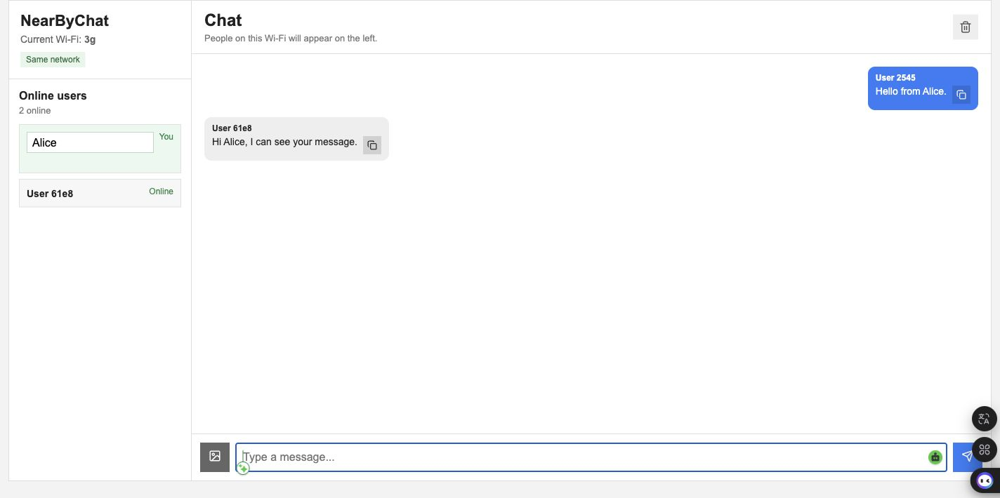

项目当前的主线版本不是本地 Node 服务器，而是 Cloudflare 版本：Cloudflare Worker 负责接收网页请求和 WebSocket 请求，Durable Object 负责保存当前房间里的在线用户，并把消息广播给同一房间中的浏览器。

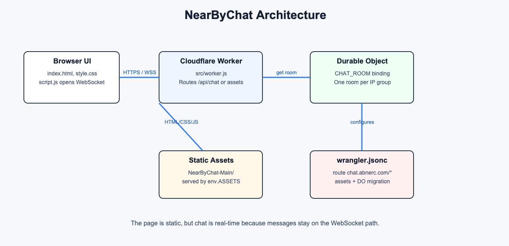

主要文件作用如下：

| 文件 | 作用 |
| --- | --- |
| `NearByChat-Main/index.html` | 页面结构，包括侧边栏、在线用户列表、聊天区、输入框和按钮。 |
| `NearByChat-Main/style.css` | 简单的聊天界面样式，包括左右布局、消息气泡、图片预览和移动端布局。 |
| `NearByChat-Main/script.js` | 前端主要逻辑：连接 WebSocket、发送消息、显示用户、渲染聊天、处理图片和清空。 |
| `src/worker.js` | Cloudflare Worker 后端，处理 `/api/chat` WebSocket，并把其他请求交给静态资源。 |
| `wrangler.jsonc` | Cloudflare 部署配置，包括路由、静态资源目录、Durable Object 绑定和 migration。 |
| `NearByChat-Main/server.js` | 本地开发/早期版本的 Node HTTP 后端，不是当前线上部署主线。 |

## 2. 前端页面和交互逻辑

前端页面由 `index.html` 搭出基本结构：左边是 `Online users`，右边是 `Chat`。页面底部的 `form#composer` 负责文字输入、图片选择和发送按钮。`script.js` 启动后会先找到这些 DOM 元素，例如 `#messageInput`、`#userList`、`#messages`、`#conversation`，然后把页面变成一个可以实时更新的聊天界面。

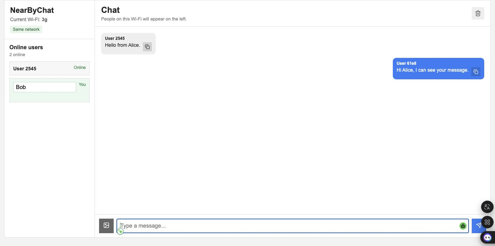

前端最重要的一步是建立 WebSocket 连接：

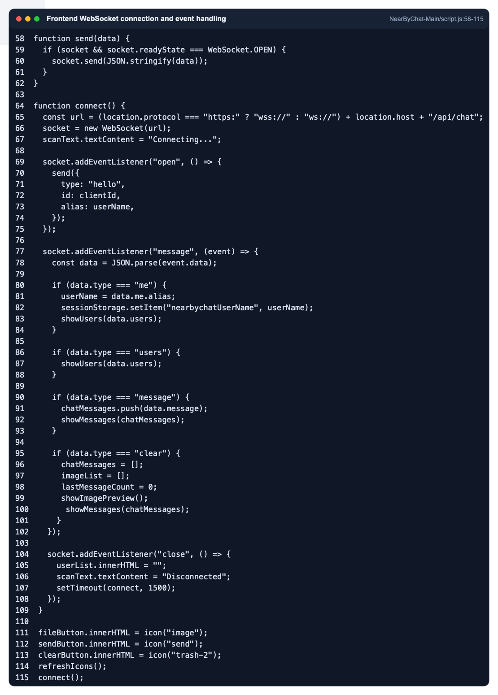

`connect()` 会根据当前页面协议创建连接地址：

```text
https 页面 -> wss://chat.abnerc.com/api/chat
http 页面  -> ws://当前 host/api/chat
```

连接打开后，前端发送 `hello` 消息，把本页的 `clientId` 和昵称发给后端。`clientId` 存在 `sessionStorage` 里，所以刷新同一个标签页时身份会保留，但新开一个标签页会有不同身份。这样同一台电脑开两个页面时，也能模拟两个在线用户。

前端收到后端消息后，会按 `type` 分开处理：

| 后端消息类型 | 前端处理 |
| --- | --- |
| `me` | 更新自己的昵称，并保存到 `sessionStorage`。 |
| `users` | 重新渲染左侧在线用户列表。 |
| `message` | 把消息加入 `chatMessages`，然后重新渲染聊天区。 |
| `clear` | 清空本地消息数组、图片预览和聊天显示。 |

在线用户和聊天消息的渲染集中在 `showUsers()` 和 `showMessages()`：

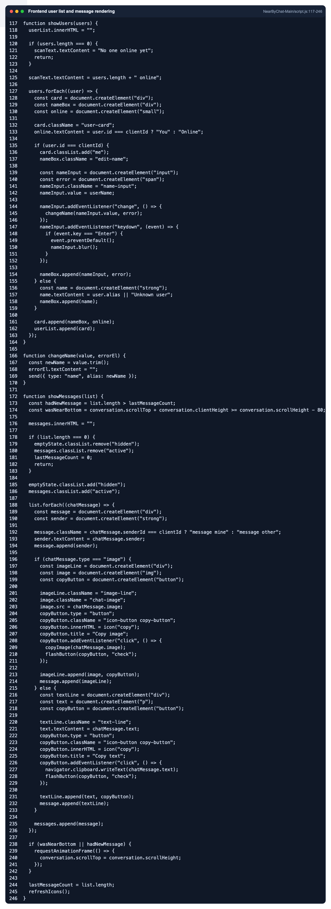

`showUsers()` 会把当前用户显示成可编辑输入框，其他用户显示成普通名字。`showMessages()` 会根据 `senderId === clientId` 判断消息是自己发的还是别人发的，从而使用 `message mine` 或 `message other` 样式，让自己的消息靠右，其他人的消息靠左。

前端还支持几个小功能：

| 功能 | 实现方式 |
| --- | --- |
| 改昵称 | 修改左侧自己的输入框后，发送 `{ type: "name", alias }`。 |
| 发文字 | 输入框按 Enter 或点击发送，发送 `{ type: "message", message: { type: "text", text } }`。 |
| 发图片 | 选择或粘贴图片后用 `FileReader` 转成 data URL，再作为 image 消息发送。 |
| 复制消息 | 文字用 `navigator.clipboard.writeText()`，图片先 `fetch()` 成 blob 再写入剪贴板。 |
| 清空聊天 | 点击垃圾桶按钮，先清空本地显示，再发送 `{ type: "clear" }` 广播给所有人。 |
| 自动滚动 | 新消息到来时滚动 `#conversation`，确保聊天停在最新位置。 |

## 3. Cloudflare Worker 和 Durable Object 后端

线上后端的入口是 `src/worker.js`。Worker 的 `fetch()` 函数先检查请求路径。如果路径是 `/api/chat`，说明这是聊天 WebSocket 请求；否则它会执行 `env.ASSETS.fetch(request)`，从 Cloudflare Static Assets 里返回 `index.html`、`style.css`、`script.js` 等静态文件。

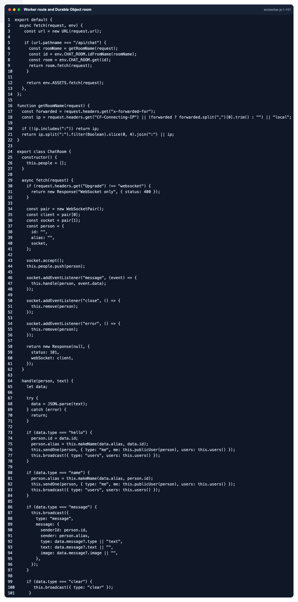

`/api/chat` 的处理流程是：

1. `getRoomName(request)` 从访问者 IP 推导一个房间名。
2. `env.CHAT_ROOM.idFromName(roomName)` 根据房间名取得 Durable Object id。
3. `env.CHAT_ROOM.get(id)` 取得对应的 `ChatRoom` 实例。
4. `room.fetch(request)` 把 WebSocket 请求交给这个 Durable Object。

`ChatRoom` 类是实时聊天的核心。它内部有一个 `people` 数组，用来记录当前连接的人。每个连接进来的浏览器都会对应一个对象：

```text
{ id, alias, socket }
```

当浏览器发来 `hello` 时，`ChatRoom` 保存这个人的 id 和昵称，并把当前用户列表广播给所有连接的人。当浏览器发来 `message` 时，`ChatRoom` 不做复杂保存，而是立刻把消息广播给所有人。当浏览器断开连接时，`remove()` 会把这个人从 `people` 里移除，并再次广播用户列表。

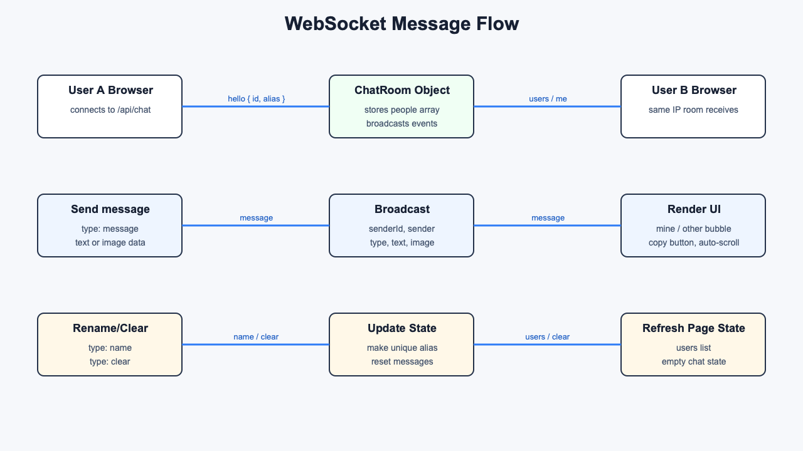

这里使用 Durable Object 的原因是：普通 Worker 请求之间不适合保存实时连接状态，而 Durable Object 可以让同一个房间的 WebSocket 连接集中到同一个对象里管理。对于聊天、多人协作、小游戏这类需要“同一组人共享状态”的功能，Durable Object 比普通无状态函数更合适。

## 4. Cloudflare 配置和 Dashboard 操作

这个项目的部署配置在 `wrangler.jsonc`：

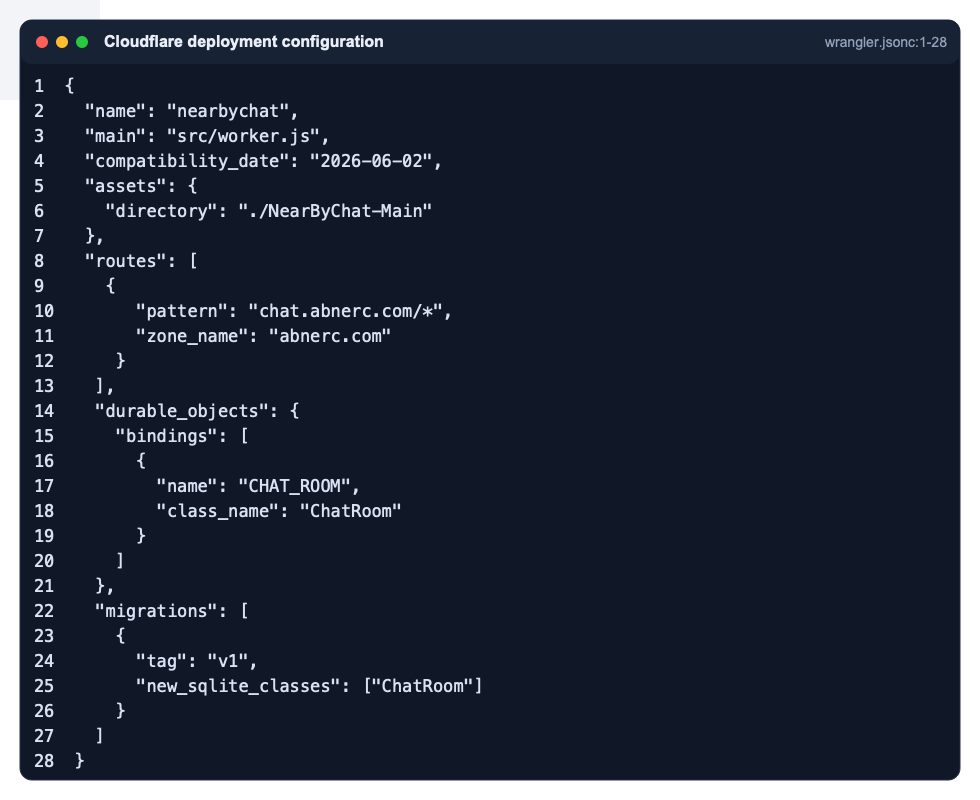

配置里最重要的部分有四个：

| 配置 | 说明 |
| --- | --- |
| `"main": "src/worker.js"` | Cloudflare 部署时运行的 Worker 入口文件。 |
| `"assets": { "directory": "./NearByChat-Main" }` | 把前端静态页面目录一起上传，让 Worker 可以通过 `env.ASSETS.fetch()` 返回网页。 |
| `"routes": [{ "pattern": "chat.abnerc.com/*", "zone_name": "abnerc.com" }]` | 让 `chat.abnerc.com/*` 的请求进入这个 Worker。 |
| `"durable_objects"` 和 `"migrations"` | 创建并绑定 `CHAT_ROOM` Durable Object，类名是 `ChatRoom`。 |

Cloudflare Worker 页面概览可以看到项目名、最近部署版本、绑定数量、请求指标和 route 信息。

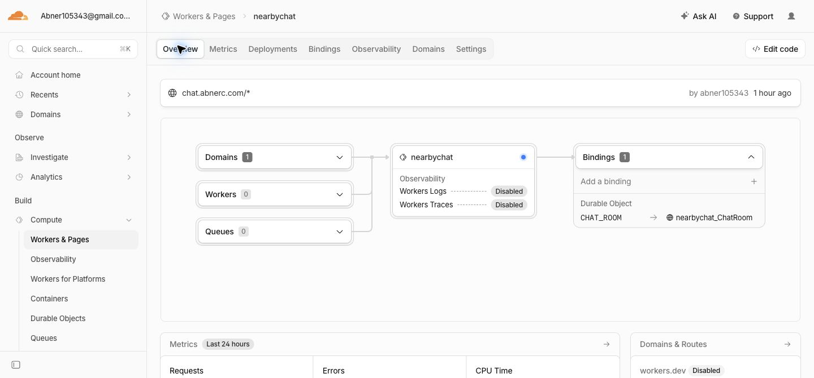

部署记录页显示这个 Worker 是通过 Wrangler 手动部署的，并且有多个版本记录。每次部署后，Cloudflare 会生成一个版本 ID，当前版本会承接 100% 流量。

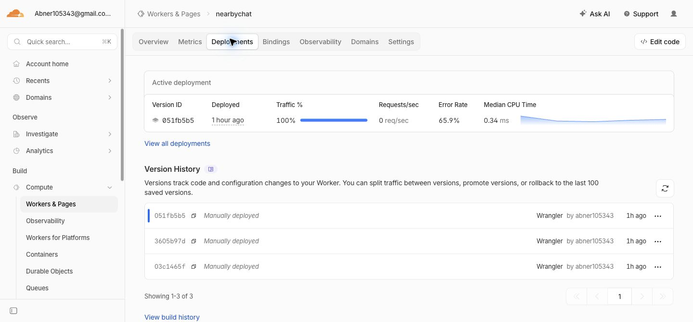

Bindings 页显示 `nearbychat` Worker 连接了一个 Durable Object，绑定名是 `CHAT_ROOM`。这和代码里的 `env.CHAT_ROOM` 对应，也和 `wrangler.jsonc` 的 `durable_objects.bindings` 对应。

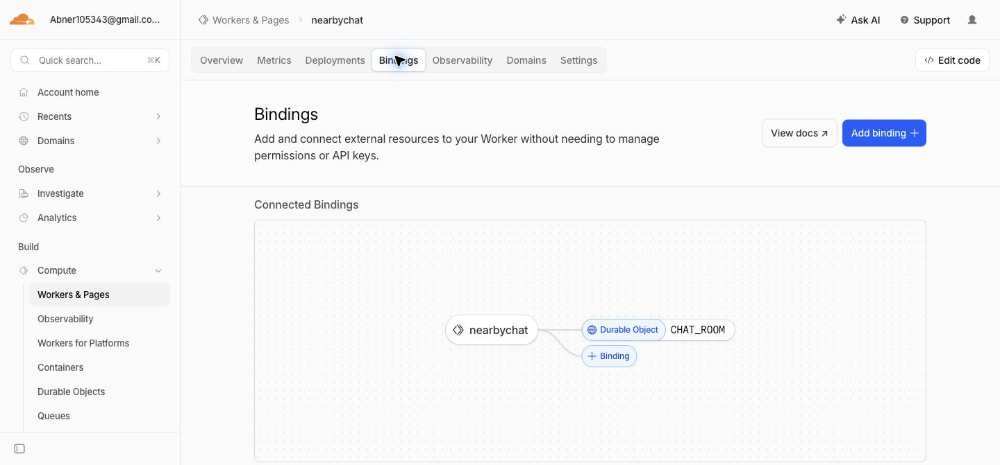

Durable Objects 页面显示命名空间 `nearbychat_ChatRoom`，并且可以看到它绑定到 `nearbychat` Worker。这里的 Storage 显示为 SQLite，是因为 `wrangler.jsonc` 使用了 `new_sqlite_classes: ["ChatRoom"]` migration。

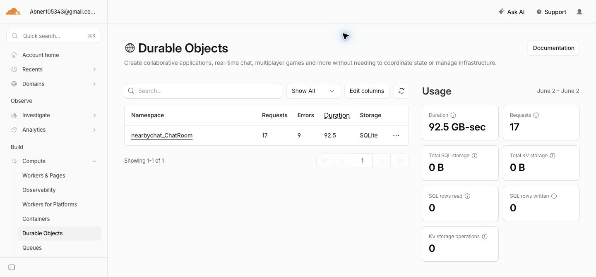

Domains & Routes 页显示 Worker URL 当前关闭，真正对外使用的是 route：`chat.abnerc.com/*`。也就是说用户访问 `chat.abnerc.com` 时，请求会被 Cloudflare 路由到这个 Worker。

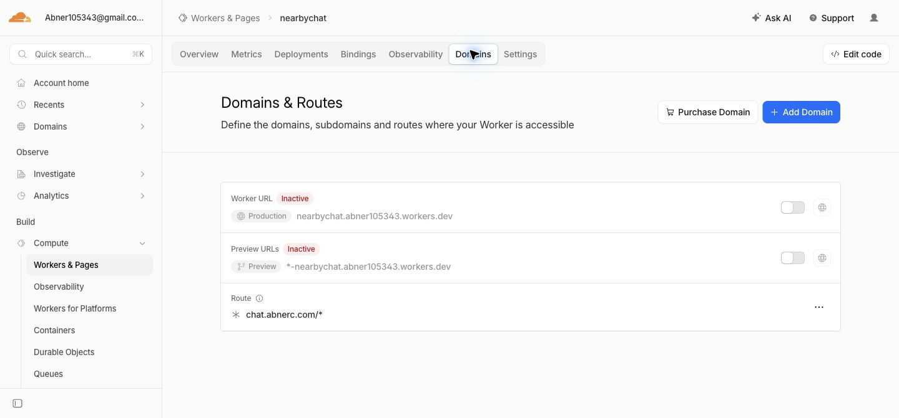

Settings 页显示运行时相关设置，例如 compatibility date 是 `Jun 2, 2026`，项目名是 `nearbychat`。当前 Dashboard 没有把 Static Assets 单独显示成一个可截图的卡片；Assets 的准确来源是 `wrangler.jsonc` 中的 `assets.directory` 配置。

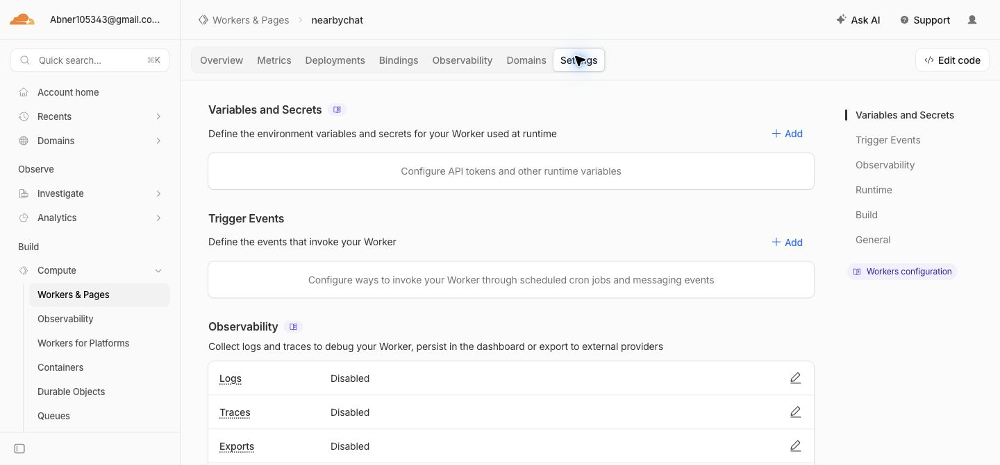

Cloudflare 官方文档中，Workers route/custom domain 用来让 Worker 接收外部请求；Static Assets 可以和 Worker 一起上传静态文件；Durable Object binding 让 Worker 通过 `env.CHAT_ROOM` 访问对象；Durable Object migration 用来创建或更新 Durable Object 类。

参考资料：

- [Cloudflare Workers routes and domains](https://developers.cloudflare.com/workers/configuration/routing/)
- [Wrangler configuration](https://developers.cloudflare.com/workers/wrangler/configuration/)
- [Workers Static Assets binding](https://developers.cloudflare.com/workers/static-assets/binding/)
- [Durable Object migrations](https://developers.cloudflare.com/durable-objects/reference/durable-objects-migrations/)

## 5. 本地 Node 后端为什么还在项目里

`NearByChat-Main/server.js` 是本地开发/早期版本的后端。它使用 Node 的 `http` 模块，在本机 `4173` 端口提供页面和 API：

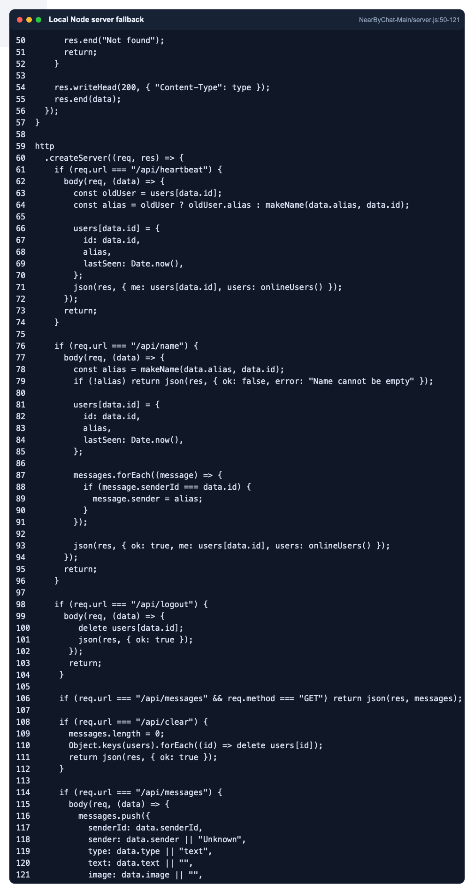

这个版本有 `/api/heartbeat`、`/api/name`、`/api/messages`、`/api/clear` 等 HTTP 接口。它适合在本机测试在线用户和聊天功能，但是它不是当前线上部署的主线。现在的线上版本用 WebSocket 和 Durable Object 做实时通信，比不断轮询 HTTP API 更适合 Cloudflare 部署。

保留 `server.js` 的意义是：它可以解释项目从本地原型到 Cloudflare 版本的变化，也可以在没有 Cloudflare 的情况下快速理解早期功能。但正式说明当前线上交互逻辑时，应以 `src/worker.js` 和 `wrangler.jsonc` 为准。

## 6. 项目的真实限制和取舍

这个项目能展示实时聊天和 Cloudflare 部署，但它仍然是一个小型演示项目，有几个需要讲清楚的限制：

| 限制 | 说明 |
| --- | --- |
| “Nearby/Same Wi-Fi” 是近似实现 | Worker 不能真正读取用户的 Wi-Fi 名称，当前是根据请求 IP 推导房间。页面里的 `Current Wi-Fi` 也只能显示浏览器提供的网络类型，例如 `3g`，不是 Wi-Fi SSID。 |
| 聊天记录不是长期保存 | 当前 `ChatRoom` 主要保存在线连接状态，消息广播后没有写入数据库。刷新或重新连接后，历史记录不会像正式聊天软件一样长期存在。 |
| 图片发送适合小图演示 | 图片用 data URL 直接放在 WebSocket 消息里，简单易懂，但大图会让消息变大，不适合正式生产环境。 |
| 昵称去重比较简单 | 后端会自动加数字避免重名，例如 `User`、`User2`，但没有账号系统或登录验证。 |
| 清空聊天会广播给所有在线用户 | 这适合演示，但正式应用通常需要权限控制。 |

这些取舍是为了让项目保持简单：前端是普通 HTML/CSS/JS，后端只用一个 Worker 和一个 Durable Object，不需要数据库、账号系统或复杂框架。这样比较适合课堂展示，也更容易讲清楚每一部分代码为什么存在。
